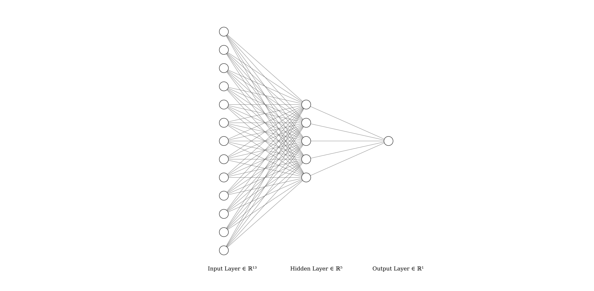
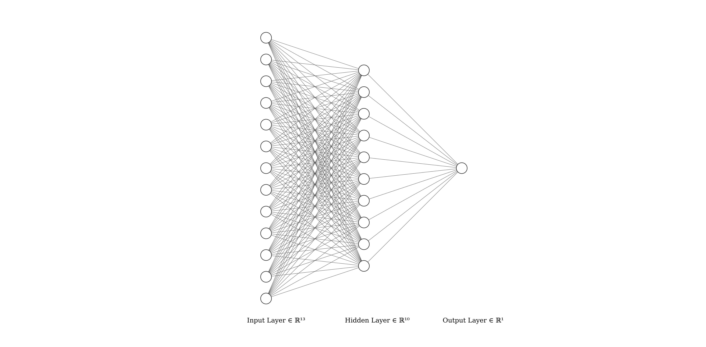
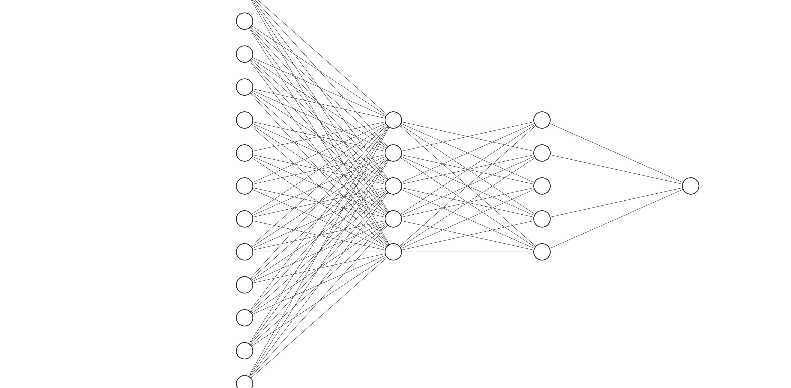

# Questions

## Les données

### Observation du tableau 1

1.  L’attribut target est celui que l’on souhaite prédire, il correspond
    au diagnostic d’une maladie cardiaque.

2.  Il s’agit ici d’une classification binaire, target étant un booléen
    qui vaut vrai si le patient a une maladie cardiaque, non si ce n’est
    pas le cas.

3.  Liste des attributs catégoriels
    
      - sex
    
      - chest\_pain\_type
    
      - falsting\_blood\_sugar
    
      - rest\_ecg
    
      - exercise\_induced\_angina
    
      - st\_slope
    
      - thalessamia
    
      - target

4.  Pour gérer les attributs catégoriels et déterminer leur indépendance
    on utilise l’algorithme de Cart ou la méthode CHAID du tableau de
    contingence.

### Normalisation des données

1.  On va centrer réduire pour conserver la variance.

2.  On le fait après avoir séparé les données pour prendre en compte la
    moyenne de chaque jeu après séparation.

3.  On normalise les champs age, resting\_blood\_pressure, cholesterol
    et max\_heart\_rate\_achieved.

## Modèles de réseaux et leurs évaluations

### Réseau de neurones avec 1 route cachée

#### 5 unités

##### Questions

Pour des lots de taille 1 et 5 neurones sur la couche cachée avec 13
paramètres, on obtient les matrices d’entrée de taille 5x1 et 1x1, les
matrices de poids de tailles 5x13 et 1x5 et les matrices de sortie de
taille 5x1 et 1x1

##### Mise en oeuvre

1.  100 époques :
    
      - Pourcentage de prédictions correctes =50.0%
    
      - Pourcentage de faux positifs =50.0%
    
      - Pourcentage de faux négatifs =0.0%
    
      - Pourcentage de vrais positifs =25.0%
    
      - Pourcentage de vrais négatifs =25.0%

2.  200 époques :
    
      - Pourcentage de prédictions correctes =75.0%
    
      - Pourcentage de faux positifs =0.0%
    
      - Pourcentage de faux négatifs =25.0%
    
      - Pourcentage de vrais positifs =0.0%
    
      - Pourcentage de vrais négatifs =75.0%

3.  500 époques :
    
      - Pourcentage de prédictions correctes =75.0%
    
      - Pourcentage de faux positifs =25.0%
    
      - Pourcentage de faux négatifs =0.0%
    
      - Pourcentage de vrais positifs =25.0%
    
      - Pourcentage de vrais négatifs =50.0%

#### 10 unités

##### Questions

Pour 10 unités sur la couche cachée, on obtient les matrices d’entrée
10x1 et 1x1, les matrices de poids 10x13 et 1x10 et les matrices de
sortie 10x1 et 1x1

##### Mise en oeuvre

1.  100 époques :
    
      - Pourcentage de prédictions correctes =50.0%
    
      - Pourcentage de faux positifs =25.0%
    
      - Pourcentage de faux négatifs =25.0%
    
      - Pourcentage de vrais positifs =0.0%
    
      - Pourcentage de vrais négatifs =50.0%

2.  200 époques :
    
      - Pourcentage de prédictions correctes =50.0%
    
      - Pourcentage de faux positifs =50.0%
    
      - Pourcentage de faux négatifs =0.0%
    
      - Pourcentage de vrais positifs =25.0%
    
      - Pourcentage de vrais négatifs =25.0%

3.  500 époques :
    
      - Pourcentage de prédictions correctes =75.0%
    
      - Pourcentage de faux positifs =0.0%
    
      - Pourcentage de faux négatifs =25.0%
    
      - Pourcentage de vrais positifs =0.0%
    
      - Pourcentage de vrais négatifs =75.0%

### Réseau de neurones avec 2 routes cachées à 5 neurones chacune

#### Questions

pour 2 couches cachées de 5 neurones chacune, on obtient les matrices
d’entrées de taille 5x1, 5x1 et 1x1, de poids 5x13, 5x5 et 1x5 et les
matrices de sortie 5x1, 5x1 et 1x1

#### Mise en oeuvre

1.  100 époques :
    
      - Pourcentage de prédictions correctes =25.0%
    
      - Pourcentage de faux positifs =75.0%
    
      - Pourcentage de faux négatifs =0.0%
    
      - Pourcentage de vrais positifs =25.0%
    
      - Pourcentage de vrais négatifs =0.0%

2.  200 époques :
    
      - Pourcentage de prédictions correctes =75.0%
    
      - Pourcentage de faux positifs =25.0%
    
      - Pourcentage de faux négatifs =0.0%
    
      - Pourcentage de vrais positifs =25.0%
    
      - Pourcentage de vrais négatifs =50.0%

3.  500 époques :
    
      - Pourcentage de prédictions correctes =100.0%
    
      - Pourcentage de faux positifs =0.0%
    
      - Pourcentage de faux négatifs =0.0%
    
      - Pourcentage de vrais positifs =25.0%
    
      - Pourcentage de vrais négatifs =75.0%

Le modèle qui nous semble le plus pertinent est le modèle à deux couches
cachées et avec un grand nombre d’époque.Les pourcentages obtenus avec
ce modèle varient moins que les autres.
