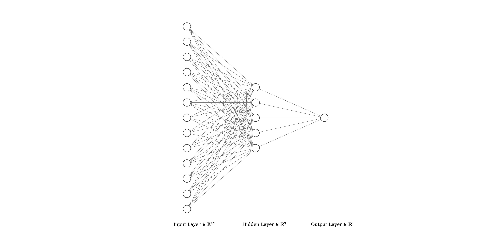

= Rapport Intelligence Artificielle
  Monfouga Marie et Arthur Rauch

== Questions

=== Les données

==== Observation du tableau 1

. L'attribut target est celui que l'on souhaite prédire, il correspond au
diagnostic d'une maladie cardiaque.

. Il s'agit ici d'une classification binaire, target étant un booléen qui vaut
vrai si le patient a une maladie cardiaque, non si ce n'est pas le cas.

. Liste des attributs catégoriels
** sex
** chest_pain_type
** falsting_blood_sugar
** rest_ecg
** exercise_induced_angina
** st_slope
** thalessamia
** target

. Pour gérer les attributs catégoriels et déterminer leur indépendance
on utilise l'algorithme de Cart ou la méthode CHAID du tableau de contingence.

==== Normalisation des données

. On va centrer réduire pour conserver la variance.

. On le fait après avoir séparé les données pour prendre en compte la
moyenne de chaque jeu après séparation.

. On normalise les champs age, resting_blood_pressure, cholesterol et
max_heart_rate_achieved.

=== Modèles de réseaux et leurs évaluations

==== Réseau de neurones avec 1 route cachée

===== 1 unité

. En entrée on va avoir une matrice de taille 13*1, 13 étant le nombre de
paramètres. Pour les matrices de paramètres on va également avoir du 13*1 et
enfin en sortie on aura une matrice d'1*1.

