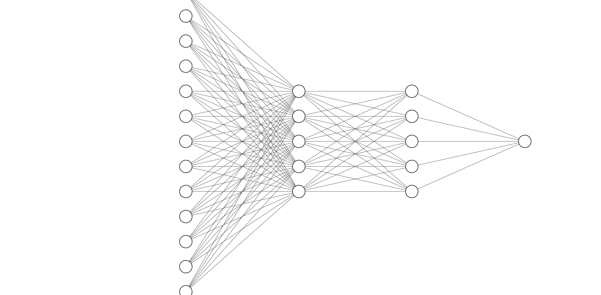

= Rapport Intelligence Artificielle
  Monfouga Marie et Arthur Rauch

== Questions

=== Les données

==== Observation du tableau 1

. L'attribut target est celui que l'on souhaite prédire, il correspond au
diagnostic d'une maladie cardiaque.

. Il s'agit ici d'une classification binaire, target étant un booléen qui vaut
vrai si le patient a une maladie cardiaque, non si ce n'est pas le cas.

. Liste des attributs catégoriels
** sex
** chest_pain_type
** falsting_blood_sugar
** rest_ecg
** exercise_induced_angina
** st_slope
** thalessamia
** target

. Pour gérer les attributs catégoriels et déterminer leur indépendance
on utilise l'algorithme de Cart ou la méthode CHAID du tableau de contingence.

==== Normalisation des données

. On va centrer réduire pour conserver la variance.

. On le fait après avoir séparé les données pour prendre en compte la
moyenne de chaque jeu après séparation.

. On normalise les champs age, resting_blood_pressure, cholesterol et
max_heart_rate_achieved.

=== Modèles de réseaux et leurs évaluations

==== Réseau de neurones avec 1 route cachée

===== 5 unités

====== Questions

Pour des lots de taille 1 et 5 neurones sur la couche cachée avec 13 paramètres,
on obtient les matrices d'entrée de taille 5x1 et 1x1,
les matrices de poids de tailles 5x13 et 1x5 et les matrices de sortie de taille 5x1 et 1x1

image::nn.jpg[]

====== Mise en oeuvre

. 100 époques :
* Pourcentage de prédictions correctes =50.0%
* Pourcentage de faux positifs =50.0%
* Pourcentage de faux négatifs =0.0%
* Pourcentage de vrais positifs =25.0%
* Pourcentage de vrais négatifs =25.0%

. 200 époques :
* Pourcentage de prédictions correctes =75.0%
* Pourcentage de faux positifs =0.0%
* Pourcentage de faux négatifs =25.0%
* Pourcentage de vrais positifs =0.0%
* Pourcentage de vrais négatifs =75.0%

. 500 époques :
* Pourcentage de prédictions correctes =75.0%
* Pourcentage de faux positifs =25.0%
* Pourcentage de faux négatifs =0.0%
* Pourcentage de vrais positifs =25.0%
* Pourcentage de vrais négatifs =50.0%

===== 10 unités

====== Questions

Pour 10 unités sur la couche cachée, on obtient les matrices d'entrée 10x1 et 1x1,
les matrices de poids 10x13 et 1x10 et les matrices de sortie 10x1 et 1x1

image::nn10.jpg[]

====== Mise en oeuvre

. 100 époques :
* Pourcentage de prédictions correctes =50.0%
* Pourcentage de faux positifs =25.0%
* Pourcentage de faux négatifs =25.0%
* Pourcentage de vrais positifs =0.0%
* Pourcentage de vrais négatifs =50.0%

. 200 époques :
* Pourcentage de prédictions correctes =50.0%
* Pourcentage de faux positifs =50.0%
* Pourcentage de faux négatifs =0.0%
* Pourcentage de vrais positifs =25.0%
* Pourcentage de vrais négatifs =25.0%

. 500 époques :
* Pourcentage de prédictions correctes =75.0%
* Pourcentage de faux positifs =0.0%
* Pourcentage de faux négatifs =25.0%
* Pourcentage de vrais positifs =0.0%
* Pourcentage de vrais négatifs =75.0%

==== Réseau de neurones avec 2 routes cachées à 5 neurones chacune

===== Questions

Pour 10 unités sur la couche cachée, on obtient les matrices d'entrée 10x1 et 1x1,
les matrices de poids 10x13 et 1x10 et les matrices de sortie 10x1 et 1x1

===== Mise en oeuvre

. 100 époques :
* Pourcentage de prédictions correctes =25.0%
* Pourcentage de faux positifs =75.0%
* Pourcentage de faux négatifs =0.0%
* Pourcentage de vrais positifs =25.0%
* Pourcentage de vrais négatifs =0.0%

. 200 époques :
* Pourcentage de prédictions correctes =75.0%
* Pourcentage de faux positifs =25.0%
* Pourcentage de faux négatifs =0.0%
* Pourcentage de vrais positifs =25.0%
* Pourcentage de vrais négatifs =50.0%

. 500 époques :
* Pourcentage de prédictions correctes =100.0%
* Pourcentage de faux positifs =0.0%
* Pourcentage de faux négatifs =0.0%
* Pourcentage de vrais positifs =25.0%
* Pourcentage de vrais négatifs =75.0%
